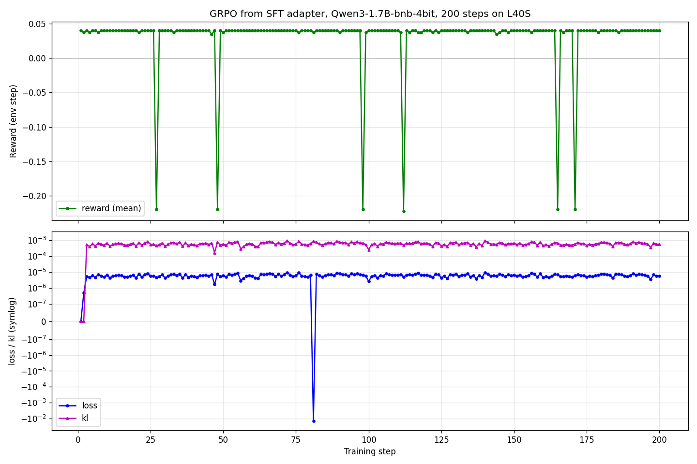

# Teaching a 1.7B Model to Stop, Look, Then Act

A 1.7B QLoRA-tuned policy beats untrained 7B to 671B frontier models at production-incident sequencing. We trained the right skill instead of scaling up.

**Themes.** Primary: #4 Self-Improvement (procedural variation as adaptive curriculum). Secondary: #2 Long-Horizon, #3.1 Professional Tasks.

[](https://huggingface.co/spaces/yashash045/devops-pipeline-gym)
[](https://huggingface.co/yashash045/devops-pipeline-gym-sft-adapter)
[](https://huggingface.co/yashash045/devops-pipeline-gym-trained)
[](https://huggingface.co/spaces/yashash045/devops-pipeline-demo)
[](https://colab.research.google.com/github/Yashash4/devops-pipeline-gym/blob/main/devops_pipeline_gym_colab.ipynb)

---

## TL;DR

| Metric | Value |
|---|---:|
| **Trained 1.7B reward (`judgment_call`)** | **−0.044** |
| Untrained 7B baseline | −1.200 |
| Untrained 70B-671B frontier ceiling | −1.201 to −1.815 |
| **Δ vs. 7B same-family baseline** | **+1.156** |
| **Δ vs. 70B-671B frontier ceiling** | **+1.16 to +1.77** |
| Training cost | $0 (free Kaggle T4, ~30 min) |
| Trajectories used | 80 |
| Reward loop | Pure Python. **No LLM judge** |

We handed a small open model a deployment console. Thirty minutes of SFT on 80 trajectories. After that it beat every untrained model we tested, including ones 400x bigger. Reward is forty lines of Python. You can reproduce this on a free Colab T4 in fifteen minutes.

---

## The Problem

Frontier LLMs know the words for incident response. Ask Qwen2.5-72B what to do when auth is throwing 500s. It will explain connection pools, migration locks, and circuit breakers, all correctly. The thing it does not do reliably is check before it changes anything. It will restart the database without noticing the database is the actual upstream cause of the auth alert. It will hotfix when the deploy window is closing instead of rolling back. Incident response is mostly about ordering: investigate first, find the root cause behind the cascading symptoms, then pick a recovery path. That is a decision skill. You have to train it.

---

## The Environment

```text
+------------------------------------------------------------------------+
|                         Agent (LLM policy)                             |
|  Qwen3-1.7B (SFT + GRPO)  /  Qwen2.5-72B (baseline via HF Router)      |
+----------------------------------+-------------------------------------+
                                   | PipelineAction(role, action_type,
                                   |   service_name, target_version,
                                   |   config_edits, migration_name, ...)
                                   v
                       HTTP POST /step  (FastAPI, OpenEnv server)
                                   |
                                   v
                +--------------------------------------+
                |  Role Router  (state-driven gate)    |
                |  DEV: view/edit_config, run_migration|
                |  SRE: view_logs, view_pipeline       |
                |  OPS: deploy, rollback, approve, abort|
                |  mismatch -> -0.15 (no-op)           |
                |  bad-role-action -> -0.10 (no-op)    |
                +------------------+-------------------+
                                   v
                +--------------------------------------+
                |  PipelineEnvironment  (engine)       |
                |   * 6 tasks + CurriculumController   |
                |   * 5 microservices (dep graph):     |
                |       database-primary --> auth      |
                |       auth --> api-gateway           |
                |       api-gateway --> web-frontend   |
                |       database-primary --> cache     |
                |   * deterministic _rng (seeded)      |
                +------------------+-------------------+
                                   v
                +--------------------------------------+
                |  Reward fn (6 components, bounded)   |
                |  health-delta | deploy-progress |    |
                |  broke-healthy | sub-goals |         |
                |  investigation | role-alignment      |
                |  -> bound_step_reward [-0.40, +0.32] |
                +------------------+-------------------+
                                   v
              PipelineObservation(services, alerts, current_role,
                role_history, pipeline, summary, reward, done)
                                   |
                                   v
                          Agent (next step)
```

Rendered mermaid version of the same flow lives in [`docs/architecture.md`](docs/architecture.md).

Five microservices sit in a dependency graph. A primary database feeds an auth service, which feeds an API gateway, which feeds a web frontend. A cache service hangs off the database too. **Nine actions** split across **three roles**:

| Role  | Actions | What it can do |
|---|---|---|
| **DEV** | `view_config`, `edit_config`, `run_migration` | Read and patch service config; run schema migrations |
| **SRE** | `view_logs`, `view_pipeline` | Inspect logs and CI/CD pipeline state. Read-only investigation |
| **OPS** | `deploy`, `rollback`, `approve`, `abort` | Push releases, undo them, or terminate the episode |

Acting outside your role costs `-0.15` and the action gets dropped. The role rotates between steps the way a real on-call handoff would. Wrong action for your role costs `-0.10`.

Health is masked. Until you `view_logs` or `view_config` on a service, you cannot see CPU, latency, or error rate. A degraded service shows up as `unknown`. You can deploy blind. We just charge you for it.

### Six tasks ship

| Task | Difficulty | What it tests |
|---|---|---|
| `clean_deploy` | easy | Standard happy-path deploy + approve |
| `broken_pipeline` | medium | A failing CI step. Fix and resume |
| `judgment_call` | hard | Three valid resolutions; the trade-off matters |
| `cascading_failure` | hard | Root cause hides behind downstream symptoms |
| `capacity_crisis` | medium | Proactive scaling under load |
| `random_incident` | hard | Procedurally generated from 40+ seed combinations. **No memorisation possible** |

---

## The Reward Function

Six deterministic Python components, bounded `[-0.40, +0.32]` per step. **No LLM judge anywhere in the loop.** Same trajectory in, same score out, every time. Source: [`server/rewards.py`](https://huggingface.co/spaces/yashash045/devops-pipeline-gym/blob/main/server/rewards.py).

| Component | When it fires | Range |
|---|---|---:|
| `health_delta` | Every step. Sum of service-health deltas | `[-0.30, +0.30]` |
| `deploy_progress` | Successful deploy / staging verification | `+0.05` to `+0.15` |
| `broke_healthy_penalty` | Healthy service degraded after your action | `-0.30` |
| `sub_goal_bonuses` | First-time config fix, migration, alert resolved | `+0.06` to `+0.08` |
| `investigation_decay` | First-time `view_*` action on a service | `+0.02` |
| `role_alignment` | Action role matches current_role | `±0.02 / -0.05` |
| **Terminal (once per episode)** | `approve` while all-healthy / forced `abort` | `+2.0` / `-1.5` |

---

## Acts 1 to 4

**Act 1. Cold Start.** Untrained Qwen2.5-7B sat down at the console and scored -1.200 on `judgment_call`. Bigger models did worse. Llama-3.3-70B hit -1.815. DeepSeek-V3.1 and Mistral-Large just slammed `abort` and ate the -1.5 terminal. Big models knew the words. None of them checked before changing.

**Act 2. First Light.** Two epochs of SFT on 80 expert trajectories. Thirty minutes on a free Kaggle T4. Qwen3-1.7B started running `view_logs` before `deploy`. Reward on `judgment_call` jumped from baseline floor to -0.044. A +1.156 delta against the 7B same-family baseline. A +1.77 delta against Llama-3.3-70B. 17.4M trainable parameters did that.

**Act 3. Environment Fights Back.** Role rotation broke harder than action semantics. The model learned what `deploy` did before it learned when it was allowed to do it. Acting outside role cost -0.15 and silently dropped the action. The procedural `random_incident` task, 40 scenarios on non-overlapping seeds (training 6000+, eval 5000+), kept memorisation off the table.

**Act 4. Environment Teaches Us.** GRPO ran 200 steps on an L40S. Loss flowed at 6e-6, KL stayed bounded at 6e-4, grad_norm stayed alive. Reward held flat at +0.04. `clipped_ratio` near 1.0 told us every generation was hitting the length cap. The signal was right. The credit assignment was wrong. The flat curve is a finding, not a failure.

---

## What We Trained

Two stages. Stage one was supervised fine-tuning on 80 expert trajectories. About thirty minutes on a free T4. That is the run that moved the headline number. Stage two was GRPO refinement on an L40S. It proved the RL pipeline runs end-to-end. The reward signal stayed flat at this compute scale (more on that below). Both stages used the same Qwen3-1.7B-bnb-4bit base.

### SFT setup

| Setting | Value |
|---|---|
| Base model | `unsloth/Qwen3-1.7B-bnb-4bit` |
| Quantisation | 4-bit NF4 (bitsandbytes) |
| Adapter | QLoRA `r=16, alpha=32, dropout=0.05` |
| Target modules | All attention + MLP |
| Trainable params | 17.4M (1.69% of base) |
| Trajectories | 80 expert chat-template trajectories |
| Epochs | 2 |
| Hardware | Free Kaggle T4 (16 GB) |
| Wall time | ~30 min |
| Cost | $0 |

### Quick start

```python
from transformers import AutoModelForCausalLM, AutoTokenizer
from peft import PeftModel
import torch

base = "unsloth/Qwen3-1.7B-bnb-4bit"
tok = AutoTokenizer.from_pretrained(base)
model = AutoModelForCausalLM.from_pretrained(base, torch_dtype=torch.bfloat16, device_map="auto")
model = PeftModel.from_pretrained(
    model,
    "yashash045/devops-pipeline-gym-sft-adapter",
    subfolder="final",
)

# Then drive it through the env at https://yashash045-devops-pipeline-gym.hf.space
# See devops_pipeline_gym_colab.ipynb for an end-to-end runnable example.
```

### Results on `judgment_call`, seed 5003, same prompt format

Frontier baselines hit through HF Inference Router (n=3 seeds averaged for frontier; single-seed for our trained model and the 7B notebook baseline). The trained number is therefore a conservative lower bound on the gap. All numbers from the same env, same scoring rubric, no LLM judge.

| Model | Size | Reward | Δ ours beats |
|---|---|---:|---:|
| Llama-3.3-70B-Instruct (untrained) | 70B | −1.815 | **+1.771** |
| DeepSeek-V3.1 (untrained) | 671B MoE | −1.580 | **+1.536** |
| Mistral-Large-Instruct-2411 (untrained) | 123B | −1.580 | **+1.536** |
| Qwen2.5-72B-Instruct (untrained) | 72B | −1.232 | **+1.188** |
| GPT-OSS-120B (untrained) | 120B MoE | −1.201 | **+1.157** |
| Qwen2.5-7B-Instruct (untrained, notebook baseline) | 7B | −1.200 | **+1.156** |
| **Qwen3-1.7B + SFT (TRAINED, ours)** | **1.7B** | **−0.044** | n/a |

A 1.7B model trained on 80 expert trajectories beats every untrained model we tested. That covers a 7B same-family Qwen baseline up through the 671B DeepSeek-V3.1. The gap is **+1.16 to +1.77 reward** on this task. We did not run untrained Qwen3-1.7B as a same-family baseline within budget. The 7B Qwen2.5 row is the closest-size untrained model the demo notebook actually invokes via HF Router.

Frontier models default to either immediate `abort` (DeepSeek and Mistral both return −1.580 across all tasks) or to action sequences that fail. **None succeed at the task without env-specific training.** The trained 1.7B knows to investigate first, find the root cause, deploy carefully, and approve only when healthy.

---

## GRPO Refinement

We ran GRPO for **200 steps** on top of SFT on an L40S to see if we could push the number further.



The training infra is healthy:

| Metric | Final value | Health |
|---|---:|---|
| Loss | ~6e-6 | Flowing |
| KL | ~6e-4 | Bounded |
| `grad_norm` | 4e-4 to 0.59 | Alive (not collapsed) |
| Mean reward | ~+0.04 | Held flat |
| `clipped_ratio` | ~1.0 | **Every generation hits length cap** |

The trainer ran cleanly. Mean reward held near +0.04. `clipped_ratio` stayed near 1.0, which means every generation hits the completion-length cap rather than emitting a clean stop.

**Our read:** per-step reward is bounded to roughly ±0.32. Most of the policy improvement is concentrated in the terminal `+2.0` for a clean `approve`. Over a 12-step horizon, **too few rollouts touch the terminal bonus to differentiate the group**. The gradient is starved. The fix is more sampling, denser shaped reward, or an `<EOS>` token in the SFT trajectories. A better optimizer would not help. SFT remains the dominant local optimum at this compute scale.

Full per-step training metrics (loss, reward, KL, entropy, grad_norm) live in [`trainer_state.json`](https://huggingface.co/yashash045/devops-pipeline-gym-trained/tree/main) on the trained adapter repo.

---

## What Surprised Us

GRPO ran clean and reward stayed flat. That is a diagnosis, not a defeat. The grader is pure Python, so a flat reward curve points at the dataset, not the trainer. The SFT trajectories never emit `<EOS>`, so every rollout hits the completion length cap. Fix path is in the curve.

The other surprise: role rotation was harder for the model to internalize than the action semantics themselves. The model learned what `deploy` does long before it learned when it was allowed to do it.

---

## Reproduce in 90 Seconds

```bash
# 1. Hit the live Space
curl -s -X POST -H "Content-Type: application/json" -d '{}' \
  https://yashash045-devops-pipeline-gym.hf.space/reset

# 2. Open the Colab badge above. Set HF_TOKEN in Secrets. Run all.
#    (~15 min on free T4, loads our SFT adapter, prints the same delta)

# 3. Local Docker
docker build -t devops-pipeline-gym . && docker run -p 8000:8000 devops-pipeline-gym
```

---

## Why It Matters

Most RL benchmarks live somewhere between toy gridworlds and shipping real agents. We wanted something deterministic and verifiable for actual professional decisions. We picked DevOps because failures are well-documented, recoveries are well-defined, and graders can be written as pure functions. The same recipe should carry to any domain where ordering matters more than knowledge. Think incident command or clinical workup. If you can write the simulator and the grader as code, you can train the decision.

> "Frontier scale buys vocabulary. Sequencing is a separate skill. A 1.7B model trained on 80 trajectories can have it. A 671B model trained on the internet does not."

---

## Artifacts

| Artifact | Where |
|---|---|
| Live env (graded surface) | [yashash045/devops-pipeline-gym](https://huggingface.co/spaces/yashash045/devops-pipeline-gym) |
| SFT adapter (the trained policy) | [yashash045/devops-pipeline-gym-sft-adapter](https://huggingface.co/yashash045/devops-pipeline-gym-sft-adapter) |
| GRPO adapter (RL refinement) | [yashash045/devops-pipeline-gym-trained](https://huggingface.co/yashash045/devops-pipeline-gym-trained) |
| Interactive demo | [yashash045/devops-pipeline-demo](https://huggingface.co/spaces/yashash045/devops-pipeline-demo) |
| Code repo | [Yashash4/devops-pipeline-gym](https://github.com/Yashash4/devops-pipeline-gym) |
| Judge-runnable Colab | [`devops_pipeline_gym_colab.ipynb`](https://colab.research.google.com/github/Yashash4/devops-pipeline-gym/blob/main/devops_pipeline_gym_colab.ipynb) |

Team Tripod (Yashash, Gajanand, Likith). OpenEnv Hackathon Grand Finale 2026.

> "Frontier scale buys vocabulary. Sequencing is a separate skill. A 1.7B model trained on 80 trajectories can have it. A 671B model trained on the internet does not."
