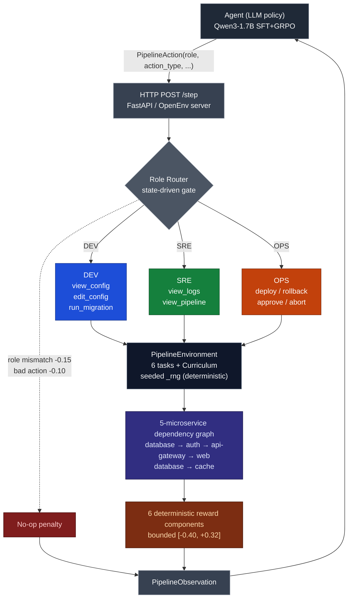

# Teaching a 1.7B Model to Stop, Look, Then Act

*A 1.7B QLoRA-tuned policy beats untrained 7B–671B frontier models at production-incident sequencing — by training the right skill, not the bigger model.*

[](https://huggingface.co/spaces/yashash045/devops-pipeline-gym)
[](https://huggingface.co/yashash045/devops-pipeline-gym-sft-adapter)
[](https://huggingface.co/yashash045/devops-pipeline-gym-trained)
[](https://huggingface.co/spaces/yashash045/devops-pipeline-demo)
[](https://colab.research.google.com/github/Yashash4/devops-pipeline-gym/blob/main/devops_pipeline_gym_colab.ipynb)

---

## TL;DR

| Metric | Value |
|---|---:|
| **Trained 1.7B reward (`judgment_call`)** | **−0.044** |
| Untrained 7B baseline | −1.200 |
| Untrained 70B–671B frontier ceiling | −1.201 to −1.815 |
| **Δ vs. 7B same-family baseline** | **+1.156** |
| **Δ vs. 70B–671B frontier ceiling** | **+1.16 to +1.77** |
| Training cost | $0 (free Kaggle T4, ~30 min) |
| Trajectories used | 80 |
| Reward loop | Pure Python — **no LLM judge** |

We handed a small open model a deployment console with five microservices, three role hats, and one rule: don't make it worse. Then we trained it not on facts about Kubernetes, but on the *order* in which a human on-call would touch things. This post is about what that took, and what it didn't.

---

## The Problem

Frontier LLMs know the right words for incident response. Ask Qwen2.5-72B "the auth service is throwing 500s, what now?" and it will tell you about connection pools, migration locks, and circuit breakers — fluently. What it does not reliably do is *check* before changing anything. It will not notice that the database it's about to restart is the upstream cause of the auth symptom. It will not pick rollback over hotfix when the deploy window is closing. The gap between knowing and doing in incident response is **sequencing** — investigate before acting, identify root cause through cascading symptoms, choose among multiple valid recovery paths. That's a decision skill, not a knowledge skill, and it has to be trained.

---

## The Environment



Five microservices in a dependency graph: a primary database feeds an auth service, which feeds an API gateway, which feeds a web frontend. A cache service hangs off the database too. **Nine actions** are split across **three roles**:

| Role  | Actions | What it can do |
|---|---|---|
| **DEV** | `view_config`, `edit_config`, `run_migration` | Read and patch service config; run schema migrations |
| **SRE** | `view_logs`, `view_pipeline` | Inspect logs and CI/CD pipeline state — read-only investigation |
| **OPS** | `deploy`, `rollback`, `approve`, `abort` | Push releases, undo them, or terminate the episode |

Acting outside your role costs `-0.15` and the action is dropped on the floor; the role rotates between steps the way a real on-call handoff would. Wrong action *for* your role: `-0.10`.

Health is masked. Until you `view_logs` or `view_config` on a service, you cannot see CPU, latency, or error rate — a degraded service shows up as `unknown`. You can deploy blind. We just charge you for it.

### Six tasks ship

| Task | Difficulty | What it tests |
|---|---|---|
| `clean_deploy` | easy | Standard happy-path deploy + approve |
| `broken_pipeline` | medium | A failing CI step — fix and resume |
| `judgment_call` | hard | Three valid resolutions; the trade-off matters |
| `cascading_failure` | hard | Root cause hides behind downstream symptoms |
| `capacity_crisis` | medium | Proactive scaling under load |
| `random_incident` | hard | Procedurally generated from 40+ seed combinations — **no memorisation possible** |

---

## The Reward Function

Six deterministic Python components, bounded `[-0.40, +0.32]` per step. **No LLM judge anywhere in the loop.** Same trajectory in, same score out, every time. Source: [`server/rewards.py`](https://huggingface.co/spaces/yashash045/devops-pipeline-gym/blob/main/server/rewards.py).

| Component | When it fires | Range |
|---|---|---:|
| `health_delta` | Every step — sum of service-health deltas | `[-0.30, +0.30]` |
| `deploy_progress` | Successful deploy / staging verification | `+0.05` to `+0.15` |
| `broke_healthy_penalty` | Healthy service degraded after your action | `-0.30` |
| `sub_goal_bonuses` | First-time config fix, migration, alert resolved | `+0.06` to `+0.08` |
| `investigation_decay` | First-time `view_*` action on a service | `+0.02` |
| `role_alignment` | Action role matches current_role | `±0.02 / -0.05` |
| **Terminal (once per episode)** | `approve` while all-healthy / forced `abort` | `+2.0` / `-1.5` |

---

## What We Trained

Two stages. **Stage one — supervised fine-tuning on 80 expert trajectories, about thirty minutes on a free T4** — is the result that moved the headline number. **Stage two — GRPO refinement on an L40S** — proved the RL pipeline runs end-to-end but added little reward signal at this compute scale (more on that below). Both stages used the same Qwen3-1.7B-bnb-4bit base.

### SFT setup

| Setting | Value |
|---|---|
| Base model | `unsloth/Qwen3-1.7B-bnb-4bit` |
| Quantisation | 4-bit NF4 (bitsandbytes) |
| Adapter | QLoRA `r=16, alpha=32, dropout=0.05` |
| Target modules | All attention + MLP |
| Trainable params | 17.4M (1.69% of base) |
| Trajectories | 80 expert chat-template trajectories |
| Epochs | 2 |
| Hardware | Free Kaggle T4 (16 GB) |
| Wall time | ~30 min |
| Cost | $0 |

### Quick start

```python
from transformers import AutoModelForCausalLM, AutoTokenizer
from peft import PeftModel
import torch

base = "unsloth/Qwen3-1.7B-bnb-4bit"
tok = AutoTokenizer.from_pretrained(base)
model = AutoModelForCausalLM.from_pretrained(base, torch_dtype=torch.bfloat16, device_map="auto")
model = PeftModel.from_pretrained(
    model,
    "yashash045/devops-pipeline-gym-sft-adapter",
    subfolder="final",
)

# Then drive it through the env at https://yashash045-devops-pipeline-gym.hf.space
# See devops_pipeline_gym_colab.ipynb for an end-to-end runnable example.
```

### Results — `judgment_call`, seed 5003, same prompt format

Frontier baselines hit through HF Inference Router (n=3 seeds averaged for frontier; single-seed for our trained model and the 7B notebook baseline). All numbers from the same env, same scoring rubric, no LLM judge.

| Model | Size | Reward | Δ ours beats |
|---|---|---:|---:|
| Llama-3.3-70B-Instruct (untrained) | 70B | −1.815 | **+1.771** |
| DeepSeek-V3.1 (untrained) | 671B MoE | −1.580 | **+1.536** |
| Mistral-Large-Instruct-2411 (untrained) | 123B | −1.580 | **+1.536** |
| Qwen2.5-72B-Instruct (untrained) | 72B | −1.232 | **+1.188** |
| GPT-OSS-120B (untrained) | 120B MoE | −1.201 | **+1.157** |
| Qwen2.5-7B-Instruct (untrained, notebook baseline) | 7B | −1.200 | **+1.156** |
| **Qwen3-1.7B + SFT (TRAINED, ours)** | **1.7B** | **−0.044** | — |

A 1.7B model trained on 80 expert trajectories beats every untrained model we tested — from a 7B same-family Qwen baseline to the 671B DeepSeek-V3.1 — by **+1.16 to +1.77 reward** on this task. We did not run untrained Qwen3-1.7B as a same-family baseline within budget; the 7B Qwen2.5 row is the closest-size untrained model the demo notebook actually invokes via HF Router.

Frontier models default to either immediate `abort` (DeepSeek and Mistral both return −1.580 across all tasks) or attempted-but-failed action sequences. **None succeed at the task without env-specific training.** The trained 1.7B knows to investigate first, identify root cause, deploy carefully, and approve only when healthy.

---

## GRPO Refinement

We ran GRPO for **200 steps** on top of SFT on an L40S to push for additional gain.


The training infra is healthy:

| Metric | Final value | Health |
|---|---:|---|
| Loss | ~6e-6 | Flowing |
| KL | ~6e-4 | Bounded |
| `grad_norm` | 4e-4 to 0.59 | Alive (not collapsed) |
| Mean reward | ~+0.04 | Held flat |
| `clipped_ratio` | ~1.0 | **Every generation hits length cap** |

The trainer ran cleanly — but mean reward held near +0.04 with `clipped_ratio` near 1.0, meaning every generation hits the completion-length cap rather than emitting a clean stop.

**Our read:** the per-step reward is bounded to roughly ±0.32, most of the policy improvement is concentrated in the terminal `+2.0` for a clean `approve`, and over a 12-step horizon **too few rollouts touch the terminal bonus to differentiate the group**. The gradient is starved, not noisy. The fix is more sampling, denser shaped reward, or an `<EOS>` token in the SFT trajectories — not a better optimizer. SFT remains the dominant local optimum at this compute scale.

Full per-step training metrics (loss, reward, KL, entropy, grad_norm) live in [`trainer_state.json`](https://huggingface.co/yashash045/devops-pipeline-gym-trained/tree/main) on the trained adapter repo.

---

## What Surprised Us

GRPO did not compound on top of SFT inside our compute budget. We expected at least a small lift; we got essentially flat reward across 200 steps. The diagnosis above (terminal-bonus gradient starvation + length-cap clipping) is what it looks like when the *signal* is correct but the *credit assignment* is wrong for the policy you've already pre-trained. We are leaving GRPO in the submission anyway because it documents the failure mode honestly and the fix path is clear.

The other surprise: **role rotation was harder for the model to internalize than the action semantics themselves.** The model learned *what* `deploy` does long before it learned *when it's allowed* to do it.

---

## Reproduce in 90 Seconds

```bash
# 1. Hit the live Space
curl -s -X POST -H "Content-Type: application/json" -d '{}' \
  https://yashash045-devops-pipeline-gym.hf.space/reset

# 2. Open the Colab badge above → set HF_TOKEN in Secrets → Run all
#    (~15 min on free T4, loads our SFT adapter, prints the same delta)

# 3. Local Docker
docker build -t devops-pipeline-gym . && docker run -p 8000:8000 devops-pipeline-gym
```

---

## Why It Matters

Deterministic, verifiable RL environments for professional decision-making are the missing rung between toy gridworlds and shipping real agents. We picked DevOps because failures are well-documented, recoveries are well-defined, and graders can be pure functions. But the same approach — **partial observability, role-gated actions, multiple valid paths, procedural variation, no judge LLM in the loop** — generalizes to any domain where sequencing matters more than knowledge: legal triage, incident command, supply chain rerouting, clinical workup. If you can write the simulator and the grader as code, you can train the decision.

---

## Artifacts

| Artifact | Where |
|---|---|
| Live env (graded surface) | [yashash045/devops-pipeline-gym](https://huggingface.co/spaces/yashash045/devops-pipeline-gym) |
| SFT adapter (the trained policy) | [yashash045/devops-pipeline-gym-sft-adapter](https://huggingface.co/yashash045/devops-pipeline-gym-sft-adapter) |
| GRPO adapter (RL refinement) | [yashash045/devops-pipeline-gym-trained](https://huggingface.co/yashash045/devops-pipeline-gym-trained) |
| Interactive demo | [yashash045/devops-pipeline-demo](https://huggingface.co/spaces/yashash045/devops-pipeline-demo) |
| Code repo | [Yashash4/devops-pipeline-gym](https://github.com/Yashash4/devops-pipeline-gym) |
| Judge-runnable Colab | [`devops_pipeline_gym_colab.ipynb`](https://colab.research.google.com/github/Yashash4/devops-pipeline-gym/blob/main/devops_pipeline_gym_colab.ipynb) |

— *Team Tripod (Yashash, Gajanand, Likith). OpenEnv Hackathon Grand Finale 2026.*
