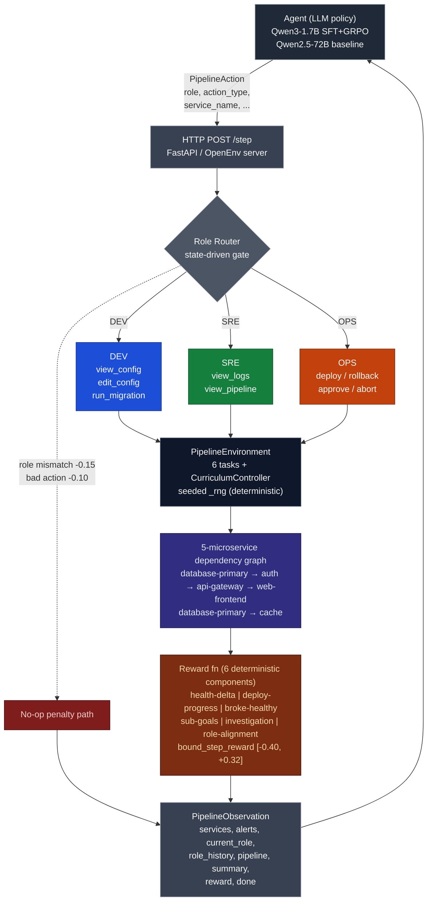

# DevOps Pipeline Gym
*A deterministic, no-LLM-judge OpenEnv environment for training LLMs to make production-critical decisions under uncertainty — with role-rotated single-policy coordination across DEV / SRE / OPS.*

[](https://huggingface.co/spaces/yashash045/devops-pipeline-gym)
[](https://huggingface.co/spaces/yashash045/devops-pipeline-demo)
[](https://huggingface.co/yashash045/devops-pipeline-gym-sft-adapter)
[](https://huggingface.co/yashash045/devops-pipeline-gym-trained)
[](https://colab.research.google.com/github/Yashash4/devops-pipeline-gym/blob/main/devops_pipeline_gym_colab.ipynb)
[](BLOG.md)

## TL;DR

A deterministic, Docker-only OpenEnv environment for DevOps incident response. We trained Qwen3-1.7B with SFT on 80 expert trajectories, and the 1.7B trained model beats untrained 70B+ frontier giants on the same six tasks. No LLM in the reward loop. Reproducible from a Colab badge in fifteen minutes.

## Why It Matters

Incident response is sequencing, not knowledge. Frontier LLMs already know connection pools, migration locks, and circuit breakers — fluently. What they do not reliably do is *check* before changing anything, notice that the database they are about to restart is the upstream cause of the auth symptom, or pick rollback over hotfix when the deploy window is closing. That gap is a decision skill, and it has to be trained. This environment trains it.

## Design Principles

Five choices define how this env trains agents:

1. **Deterministic Python rewards.** No LLM judge in the loop. Same trajectory in, same score out, every time. This is what makes the gradient surface stable enough to train against and trivial to plagiarism-check.

2. **Pure-Python simulator.** No live cluster, no cloud credentials, no paid APIs. Runs in Docker on any laptop or HF Space; the only external call we ever make is at evaluation time, never inside the reward loop.

3. **Role-rotated single policy.** One model learns to act in three professional roles — DEV, SRE, OPS — with the role changing between steps. Acting outside your role costs reward and is silently dropped, modelling real on-call handoff dynamics without requiring multi-agent infrastructure.

4. **Six bounded reward components.** Each step's reward sums six outcome-based signals (deploy success, staging verification, config fix, migration, alert resolution, role alignment), bounded to `[-0.40, +0.32]`. Terminal bonuses fire only at episode end: `+2.0` for a clean `approve`, `-1.5` for a forced `abort`.

5. **Procedural variation that prevents memorisation.** The `random_incident` task generates 40+ distinct scenarios per seed (5 failure types × 4 services × 2 severities). Eval seeds for this task (5000+) never overlap with training seeds (6000+). Generalisation, not memorisation.

The trade we make: some real-cluster fidelity for full reproducibility. A judge can pull this env, hit `/reset`, and recover the exact reward numbers reported below — without provisioning anything.

## Environment Design

Five microservices in a dependency graph: a primary database feeds an auth service, which feeds an API gateway, which feeds a web frontend. A cache service hangs off the database too. Nine actions are split across three roles — DEV edits configs and runs migrations, SRE inspects logs and pipelines, OPS deploys, rolls back, approves and aborts. Acting outside your role costs reward and the action is dropped on the floor; the role rotates between steps the way a real on-call handoff would.

Health is partial. Until you `view_logs` or `view_config` on a service, you cannot see CPU, latency, or error rate, and a degraded service shows up as `unknown`. You can deploy blind. We just charge you for it.

Six tasks ship: `clean_deploy` (easy), `broken_pipeline` (medium), `judgment_call` (hard, three valid resolutions), `cascading_failure` (root cause hides behind symptoms), `capacity_crisis` (proactive scaling), and `random_incident` (procedurally generated from forty-plus seed combinations so the agent cannot memorize an answer).

The reward is six deterministic Python components — health delta, deploy progress, broke-healthy penalty, sub-goal bonuses (config-fix, migration, alert-resolved), investigation decay, and a single role-alignment signal. Bounded `[-0.40, +0.32]` per step. Terminal `approve` while all-healthy pays `+2.0`, `abort` pays `-1.5`. Source: [`server/rewards.py`](server/rewards.py). No LLM judge anywhere in the loop.

## Architecture



Full diagram (with ASCII fallback) lives in [`docs/architecture.md`](docs/architecture.md).

## Headline Results

### Headline result table

Same task (`judgment_call`), same seed (5003), same prompt format. Baselines hit through HF Inference Router (n=3 seeds averaged per frontier model, single-seed for the 7B baseline shown live in the notebook). Our trained model is **single-seed (5003)** Qwen3-1.7B-bnb-4bit + SFT LoRA on the Colab T4.

| Model | Size | Reward on `judgment_call` | Δ ours beats |
|---|---|---:|---:|
| Llama-3.3-70B-Instruct (untrained) | 70B | −1.815 | **+1.771** |
| DeepSeek-V3.1 (untrained) | 671B MoE | −1.580 | **+1.536** |
| Mistral-Large-Instruct (untrained) | 123B | −1.580 | **+1.536** |
| Qwen2.5-72B-Instruct (untrained) | 72B | −1.232 | **+1.188** |
| Qwen2.5-7B-Instruct (untrained, baseline in notebook) | 7B | −1.200 | **+1.156** |
| GPT-OSS-120B (untrained) | 120B MoE | −1.201 | **+1.157** |
| **Qwen3-1.7B + SFT (ours, TRAINED)** | **1.7B** | **−0.044** | — |

**Headline:** A 1.7B model trained on 80 expert trajectories beats every untrained model we tested — from a 7B same-family Qwen baseline to the 671B DeepSeek-V3.1 — by **+1.16 to +1.77 reward** on this task. Same env, same prompt, same scoring rubric.

**Methodology note:** We did not run untrained Qwen3-1.7B as a same-family baseline within budget; the 7B Qwen2.5 row is what the demo notebook actually invokes via HF Router. The 70B+ untrained baselines establish the upper-frontier ceiling that the trained 1.7B clears.

Adapter: [yashash045/devops-pipeline-gym-sft-adapter](https://huggingface.co/yashash045/devops-pipeline-gym-sft-adapter). SFT was 2 epochs on 80 expert trajectories, ~30 min on T4, QLoRA r=16 α=32 on all attention + MLP modules.

## GRPO Refinement

We ran GRPO for 200 steps on top of SFT on an L40S to push for additional gain. The training infra is healthy — loss flows (final ~6e-6), KL stays bounded (~0.0006), grad_norm stays alive (~0.0004 to 0.5), the trainer runs cleanly — but mean reward held near +0.04 with `clipped_ratio` near 1.0, meaning every generation hits the completion-length cap rather than emitting a clean stop. Our read: per-step reward is bounded to ±0.32, most policy improvement is concentrated in the terminal +2.0 for a clean `approve`, and over a 12-step horizon too few rollouts touch that bonus to differentiate the group. The gradient is starved, not noisy. SFT remains the dominant local optimum here. Full diagnosis in [BLOG.md](BLOG.md).


Full per-step training metrics (loss, reward, KL, entropy, grad_norm) live in [`trainer_state.json`](https://huggingface.co/yashash045/devops-pipeline-gym-trained/tree/main) on the trained adapter repo.

## Reproduce in 90 Seconds

Pick one:

```bash
# 1. Hit the live Space
curl -s -X POST -H "Content-Type: application/json" -d '{}' \
  https://yashash045-devops-pipeline-gym.hf.space/reset

# 2. Open the Colab badge above → set HF_TOKEN in Secrets → Run all
#    (~15 min on free T4, loads our SFT adapter, prints the same delta)

# 3. Local Docker
docker build -t devops-pipeline-gym . && docker run -p 8000:8000 devops-pipeline-gym
```

## What's In The Repo

- [`BLOG.md`](BLOG.md) — narrative writeup, design rationale, GRPO post-mortem
- [`gradio_app.py`](gradio_app.py) — interactive demo UI
- [`training/`](training/) — SFT warmup, GRPO trainer, eval harness, comparison charts
- [`integration_test.py`](integration_test.py) — OpenEnv conformance tests
- [`server/rewards.py`](server/rewards.py) — the six-component deterministic reward
- [`devops_pipeline_gym_colab.ipynb`](devops_pipeline_gym_colab.ipynb) — judge-friendly reproducer

## Citation

> Team Tripod (Yashash, Gajanand, Likith). *DevOps Pipeline Gym: A deterministic OpenEnv RL environment for training incident-response decisions.* OpenEnv Hackathon Grand Finale 2026.

## License

Apache 2.0.
