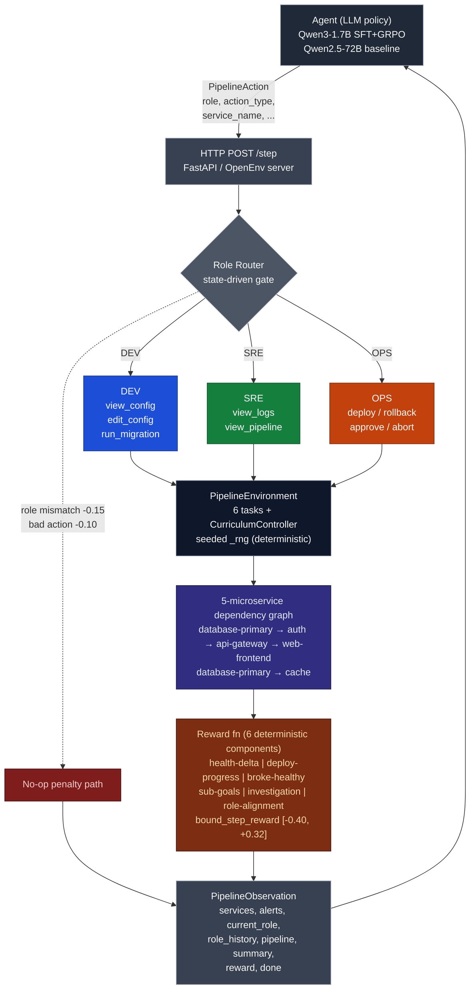

# DevOps Pipeline Gym, Architecture

This is the quick tour. An LLM agent sends actions. The **role gate** decides which actions count for the current role. A graph of 5 microservices reacts. Six deterministic reward terms add up to a bounded per-step reward in `[-0.40, +0.32]`.

---

## ASCII (terminal-safe fallback)

```text
+------------------------------------------------------------------------+
|                         Agent (LLM policy)                             |
|  Qwen3-1.7B (SFT + GRPO)  /  Qwen2.5-72B (baseline via HF Router)      |
+----------------------------------+-------------------------------------+
                                   | PipelineAction(role, action_type,
                                   |   service_name, target_version,
                                   |   config_edits, migration_name, ...)
                                   v
                       HTTP POST /step  (FastAPI, OpenEnv server)
                                   |
                                   v
                +--------------------------------------+
                |  Role Router  (state-driven gate)    |
                |  DEV: view/edit_config, run_migration|
                |  SRE: view_logs, view_pipeline       |
                |  OPS: deploy, rollback, approve, abort|
                |  mismatch -> -0.15 (no-op)           |
                |  bad-role-action -> -0.10 (no-op)    |
                +------------------+-------------------+
                                   v
                +--------------------------------------+
                |  PipelineEnvironment  (engine)       |
                |   * 6 tasks + CurriculumController   |
                |   * 5 microservices (dep graph):     |
                |       database-primary --> auth      |
                |       auth --> api-gateway           |
                |       api-gateway --> web-frontend   |
                |       database-primary --> cache     |
                |   * deterministic _rng (seeded)      |
                +------------------+-------------------+
                                   v
                +--------------------------------------+
                |  Reward fn (6 components, bounded)   |
                |  health-delta | deploy-progress |    |
                |  broke-healthy | sub-goals |         |
                |  investigation | role-alignment      |
                |  -> bound_step_reward [-0.40, +0.32] |
                +------------------+-------------------+
                                   v
              PipelineObservation(services, alerts, current_role,
                role_history, pipeline, summary, reward, done)
                                   |
                                   v
                          Agent (next step)
```

---

## Mermaid (rendered in README / GitHub)



---

## Key invariants the diagram encodes

- **Single policy, role-conditioned**: one model. The role lives in the observation
  (`current_role`) and on the action (`PipelineAction.role`). There are no
  separate policies per role.
- **Role gate is hard**: a mismatched `action.role` short-circuits with `-0.15`
  and the action does **not** execute. A wrong action for the current role costs
  `-0.10`.
- **Deterministic env**: scenarios load with `chosen_seed`. `random_incident`
  honours `DEVOPS_SEED`. There is no `random.random()` and no `hash()` anywhere.
- **No LLM in env runtime**: graders, curriculum, and scenarios are pure Python.
- **Reward = 5 outcome components + role_alignment**, then bounded to
  `[-0.40, +0.32]`. The terminal bonus fires once per episode (on approve, abort,
  or timeout) and sits on top of the per-step bound.
- **Curriculum picks the task** in `reset()` unless an explicit task is requested
  (via kwargs or the `DEVOPS_TASK` env var).

---

## How to embed in the README

Inline mermaid for GitHub:
~~~markdown
## Architecture

```mermaid
flowchart TD
    ... (paste from docs/architecture.md)
```
~~~

Rendered PNG for HF Space READMEs:
```markdown
## Architecture

```
Generate the PNG with:
```bash
python scripts/render_diagram.py
```

ASCII fallback:
````markdown
## Architecture
```text
... (paste ASCII block from docs/architecture.md)
```
````
